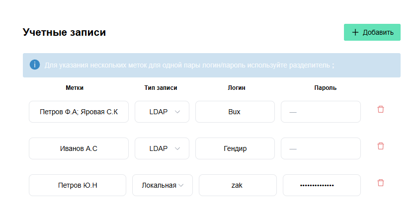

# Vue Account Manager

Приложение для управления учетными записями (логин/пароль) с современным интерфейсом. Поддерживает два типа записей: LDAP и Локальная, с полной валидацией полей и персистентностью данных в localStorage.

# Скриншоты

<!-- Один скрин -->


# Функциональность

- **CRUD операции**: Добавление, редактирование и удаление учетных записей
- **Валидация полей**: Обязательные поля, ограничения по длине (логин, пароль, метки до 50 символов)
- **Персистентность данных**: Автоматическое сохранение в localStorage с помощью Pinia Persisted State
- **Поддержка типов записей**: LDAP (без пароля) и Локальная (с паролем)
- **Метки**: Поддержка множественных меток с разделителем ";"
- **UX улучшения**: Loading states, confirm dialogs, error handling
- **Адаптивный дизайн**: Темная тема, responsive layout

# Архитектура

Проект построен на современной стеке Vue 3 с Composition API:

- **Frontend Framework**: Vue 3 (Composition API)
- **Язык**: TypeScript для типобезопасности
- **State Management**: Pinia с persisted state plugin
- **UI Library**: Naive UI (Vue 3 компоненты)
- **Routing**: Vue Router 4
- **Build Tool**: Vite
- **Testing**: Vitest + Vue Test Utils (unit), Cypress (e2e)
- **Linting/Formatting**: ESLint + Prettier
- **Validation**: Vuelidate


# Установка и запуск

# Предварительные требования

- Node.js >= 18
- npm или yarn

# Установка

```bash
# Клонировать репозиторий
git clone https://github.com/Zakirov-Yuriy/vue-account-manager.git
cd vue-account-manager

# Установить зависимости
npm install
```

# Запуск в режиме разработки

```bash
npm run dev
```

Приложение будет доступно на http://localhost:5173/

# Сборка для продакшена

```bash
npm run build
npm run preview
```

# Скрипты

| Команда | Описание |
|---------|----------|
| `npm run dev` | Запуск dev сервера с hot reload |
| `npm run test:unit` | Запуск unit тестов (Vitest) |
| `npm run test:e2e` | Запуск e2e тестов (Cypress) |
| `npm run test:e2e:dev` | Запуск e2e тестов в dev режиме |
| `npm run lint` | Проверка кода ESLint |
| `npm run format` | Форматирование кода Prettier |
| `npm run type-check` | Проверка типов TypeScript |

# Тестирование

# Unit тесты

Тесты написаны с использованием Vitest и @vue/test-utils:

```bash
npm run test:unit
```

# E2E тесты

E2E тесты с Cypress:

```bash
# В dev режиме
npm run test:e2e:dev

# В headless режиме
npm run test:e2e
```

# Разработка

Проект следует принципам SOLID, DRY, KISS. Код полностью типизирован TypeScript, покрыт тестами и отформатирован.


